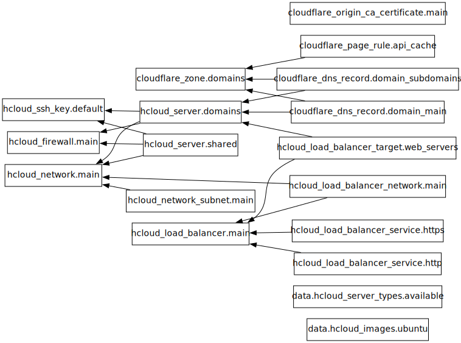

# Welcome to the All Things Linux Infrastructure Docs

This documentation provides a comprehensive overview of the infrastructure, automation, and operational guides for the All Things Linux community.

## 🚀 Key Areas

- **[Infrastructure](infrastructure/overview.md)**: Detailed information about the cloud resources, networking, and architecture.
- **[Automation](automation/playbooks.md)**: Guides on Ansible playbooks, roles, and CLI tools.
- **[Guides](guides/development.md)**: Development, deployment, and security best practices.

Explore the documentation to get started with development, understand the deployment process, or dive deep into the infrastructure setup.

## 🚀 **Quick Start**

New to our infrastructure? Start here:

1. **[Quick Start Guide](guides/development.md)** - Get up and running in minutes
2. **[Development Workflow](guides/development.md)** - Learn our development practices
3. **[CLI Tools](automation/cli-tools.md)** - Master the infrastructure CLI commands

## 🏗️ **Infrastructure Overview**

Our infrastructure is built on modern DevOps principles:

=== "Dynamic Domain Management"
    ```yaml
    # domains.yml - Single source of truth
    domains:
      - name: "api.allthingslinux.org"
        service: "backend-api"
        ssl: true
        monitoring: true
    ```

=== "Automated Deployments"
    ```bash
    # Deploy with our CLI tools
    atl apply --target domain --domain-name api.allthingslinux.org
    ```

=== "Infrastructure as Code"
    ```bash
    # All infrastructure defined as code
    atl lint                         # Validate everything
atl plan                         # Preview changes
atl apply                        # Deploy changes
    ```

## 📊 **Architecture Diagrams**

Our infrastructure architecture is automatically generated and kept up-to-date:

{ width="100%" }

!!! info "Live Diagrams"
    These diagrams are automatically generated from our Terraform configuration and updated with every deployment.

## 🛠️ **Core Components**

### **Infrastructure Management**

- **[Terraform Modules](infrastructure/terraform.md)** - Reusable infrastructure components
- **[Network Architecture](infrastructure/overview.md)** - Network design and security
- **[Domain Management](infrastructure/overview.md)** - Dynamic domain configuration

### **Automation & Deployment**

- **[Ansible Playbooks](automation/playbooks.md)** - Service deployment and configuration
- **[Ansible Roles](automation/roles.md)** - Reusable automation components
- **[CLI Tools](automation/cli-tools.md)** - Custom management utilities

### **Monitoring & Observability**

- **Real-time Monitoring** - Health checks and metrics
- **Log Aggregation** - Centralized logging and analysis
- **Alert Management** - Automated incident response

## 🔧 **Management Tools**

We've built a comprehensive CLI toolkit for infrastructure management:

| Command | Purpose | Example |
|---------|---------|---------|
| `atl infra` | Infrastructure deployment | `atl infra apply --target all` |
| `atl quality` | Code quality validation | `atl quality lint --fix` |
| `atl utils` | Collection management | `atl utils update-collections` |
| `atl docs` | Documentation generation | `atl docs build --serve` |

## 🌟 **Key Features**

### **Dynamic Configuration**

- **Single Source of Truth**: All domains and services defined in `domains.yml`
- **Automatic SSL**: TLS certificates automatically provisioned and renewed
- **Health Monitoring**: Built-in health checks and alerting

### **Developer Experience**

- **Rich CLI Output**: Beautiful, informative command-line interfaces
- **Comprehensive Validation**: Multiple layers of code quality checks
- **Live Documentation**: This documentation is automatically generated and updated

### **Security & Compliance**

- **Automated Security Scanning**: Vulnerability detection in code and infrastructure
- **Access Control**: Role-based access management
- **Audit Logging**: Complete audit trail of all changes

## 📈 **Community Stats**

!!! success "Infrastructure Scale"
    - **10,000+** community members served
    - **99.9%** uptime achieved
    - **15+** services automatically managed
    - **100%** infrastructure as code

## 🚦 **Current Status**

The infrastructure status is monitored in real-time:

- ✅ **All Services**: Operational
- ✅ **Domain Resolution**: Healthy
- ✅ **SSL Certificates**: Valid
- ✅ **Monitoring**: Active

## 🤝 **Contributing**

Want to contribute to our infrastructure? Check out our guides:

- **[Development Workflow](guides/development.md)** - How we work with infrastructure code
- **[Security Guidelines](guides/security.md)** - Security best practices
- **[Troubleshooting](reference/troubleshooting.md)** - Common issues and solutions

## 📚 **External Resources**

- [GitHub Repository](https://github.com/allthingslinux/infra)
- [Discord Community](https://discord.gg/linux)
- [All Things Linux Website](https://allthingslinux.org)

---

!!! note "Live Documentation"
    This documentation is automatically generated from our infrastructure code and updated with every deployment. Last updated: {{ git.date }}
