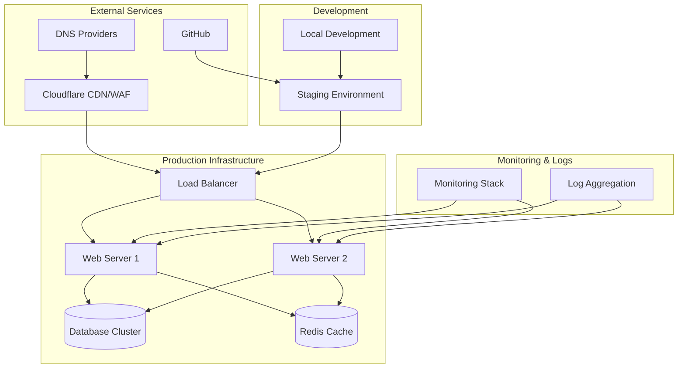
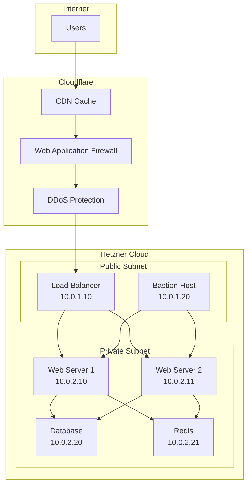
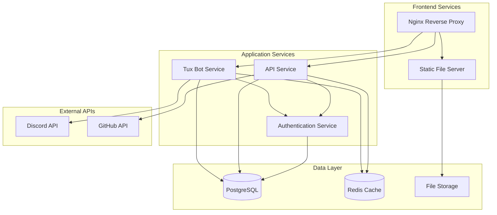
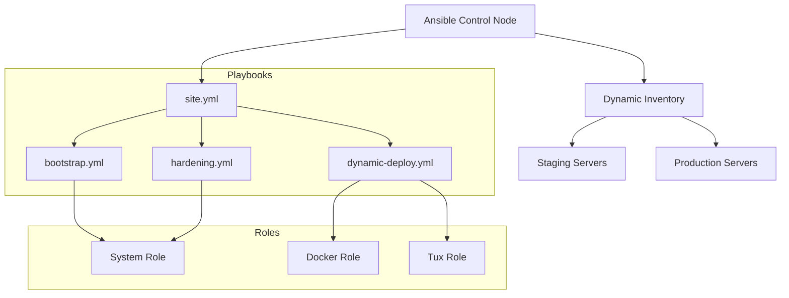
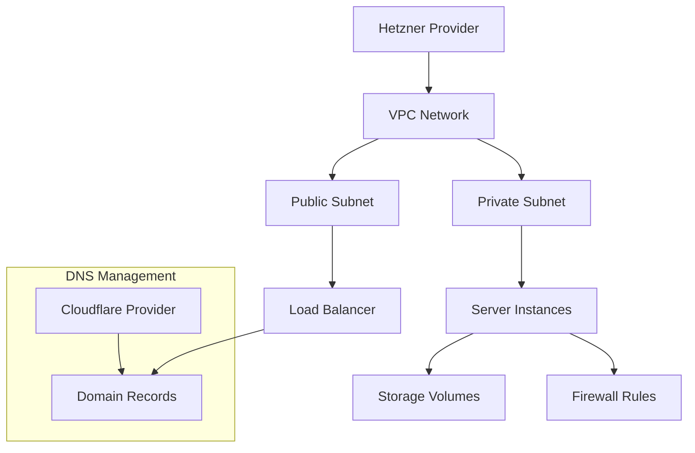
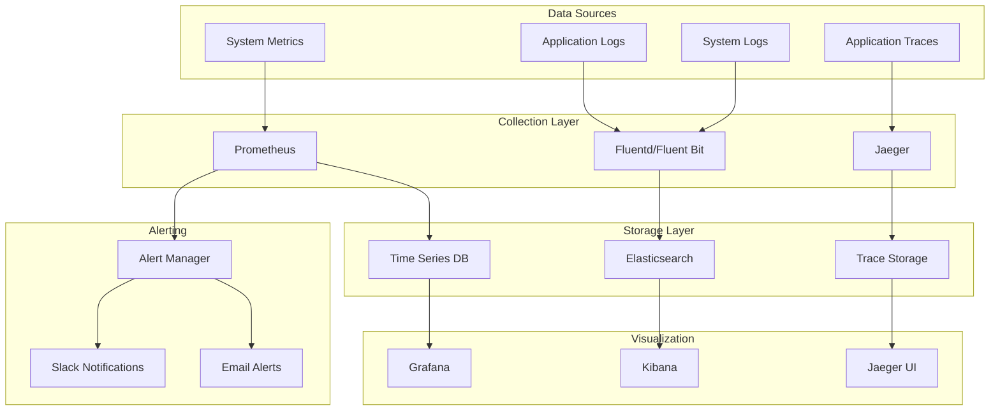
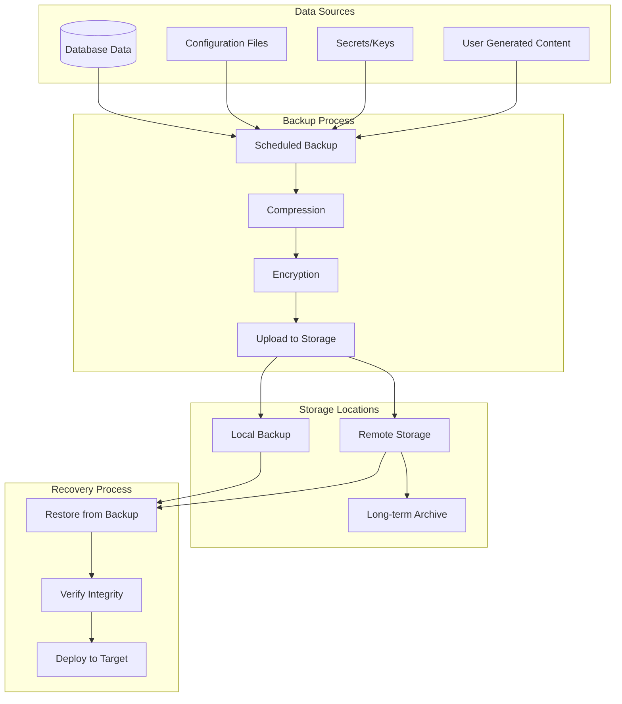

# Infrastructure Diagrams

This page contains automatically generated diagrams of the infrastructure architecture.

## Terraform Graph

The following diagram is generated from the Terraform configuration and shows the relationships between all resources.

## Infrastructure Overview

## Deployment Pipeline

```mermaid
graph LR
    DEV[Local Development] --> COMMIT[Git Commit]
    COMMIT --> PR[Pull Request]
    PR --> REVIEW[Code Review]
    REVIEW --> MERGE[Merge to Main]
    MERGE --> BUILD[CI Build]
    BUILD --> TEST[Automated Tests]
    TEST --> DEPLOY_STAGING[Deploy to Staging]
    DEPLOY_STAGING --> MANUAL_TEST[Manual Testing]
    MANUAL_TEST --> DEPLOY_PROD[Deploy to Production]
    DEPLOY_PROD --> MONITOR[Monitor & Verify]
```

## Network Architecture

## Service Dependencies

## Ansible Automation Flow

## Terraform Resource Dependencies

## Monitoring Architecture

## Security Architecture

```mermaid
graph TB
    subgraph "External Security"
        CLOUDFLARE_SEC[Cloudflare Security]
        DDOS_PROT[DDoS Protection]
        WAF_RULES[WAF Rules]
    end

    subgraph "Network Security"
        VPC[VPC Isolation]
        SECURITY_GROUPS[Security Groups]
        NACL[Network ACLs]
    end

    subgraph "Host Security"
        HARDENING[OS Hardening]
        FIREWALL_HOST[Host Firewall]
        FAIL2BAN[Fail2ban]
    end

    subgraph "Application Security"
        TLS[TLS Encryption]
        AUTH_JWT[JWT Authentication]
        RBAC[Role-Based Access]
    end

    subgraph "Data Security"
        ENCRYPTION[Data Encryption]
        BACKUP_ENC[Encrypted Backups]
        SECRET_MGT[Secret Management]
    end

    CLOUDFLARE_SEC --> DDOS_PROT
    CLOUDFLARE_SEC --> WAF_RULES

    VPC --> SECURITY_GROUPS
    VPC --> NACL

    HARDENING --> FIREWALL_HOST
    HARDENING --> FAIL2BAN

    TLS --> AUTH_JWT
    AUTH_JWT --> RBAC

    ENCRYPTION --> BACKUP_ENC
    ENCRYPTION --> SECRET_MGT
```

## Backup and Recovery Flow

## Related Documentation

- [Infrastructure Overview](overview.md)
- [Terraform Modules](terraform.md)
- [CLI Tools](../automation/cli-tools.md)
