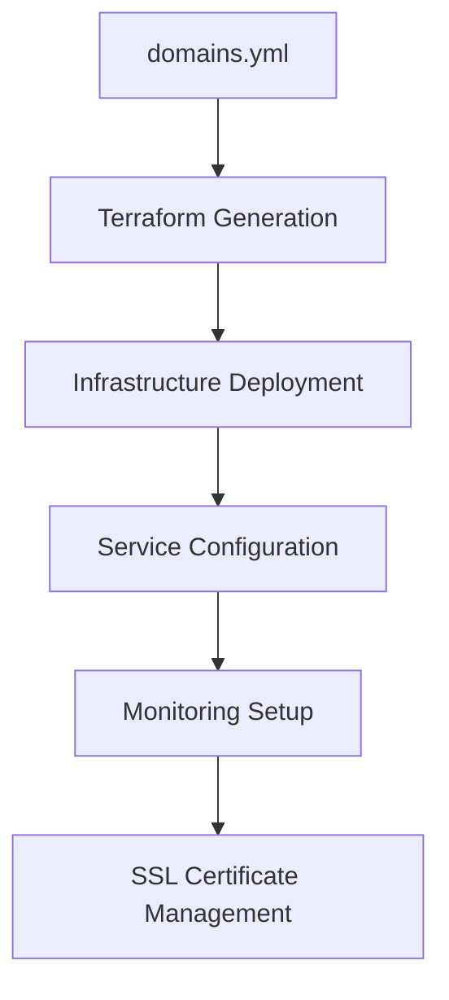

# Infrastructure Overview

The All Things Linux infrastructure is designed for scalability, reliability, and ease of management. Our architecture supports a community of over 10,000 members with automated deployments and monitoring.

## 🏗️ **Architecture Principles**

### **Data-Driven Configuration**

All infrastructure is defined through a single source of truth: the `domains.yml` file. This declarative approach ensures consistency and enables automated management.

```yaml
# Example domain configuration
domains:
  - name: "api.allthingslinux.org"
    service: "backend-api"
    ssl: true
    monitoring: true
    replicas: 3
    resources:
      cpu: "500m"
      memory: "512Mi"
```

### **Dynamic Infrastructure Generation**

Our Terraform configuration is dynamically generated from the domain configuration, ensuring that infrastructure matches the declared state.



## 🌐 **Network Architecture**

### **Load Balancing**

- **Primary Load Balancer**: Handles all incoming traffic
- **SSL Termination**: TLS certificates managed automatically
- **Health Checks**: Continuous monitoring of backend services

### **Service Mesh**

- **Service Discovery**: Automatic service registration
- **Traffic Routing**: Intelligent load distribution
- **Circuit Breakers**: Automatic failure handling

### **Security**

- **WAF Protection**: Web Application Firewall
- **DDoS Mitigation**: Cloudflare protection
- **Network Segmentation**: Isolated service networks

## 🔧 **Infrastructure Components**

### **Compute Resources**

- **Container Orchestration**: Docker-based service deployment
- **Auto-scaling**: Dynamic resource allocation
- **Resource Management**: CPU and memory optimization

### **Storage Systems**

- **Persistent Storage**: Database and file storage
- **Backup Systems**: Automated backup and recovery
- **Content Delivery**: CDN for static assets

### **Monitoring & Observability**

- **Metrics Collection**: Real-time performance monitoring
- **Log Aggregation**: Centralized logging system
- **Alerting**: Automated incident response

## 📊 **Current Configuration**

{!../domains.yml!}

## 🚀 **Deployment Process**

1. **Configuration Update**: Modify `domains.yml`
2. **Validation**: Run linting and validation checks
3. **Plan Generation**: Create Terraform execution plan
4. **Infrastructure Update**: Apply changes to infrastructure
5. **Service Deployment**: Deploy or update services
6. **Health Verification**: Validate service health
7. **Monitoring Setup**: Configure monitoring and alerts

## 📈 **Scaling Strategy**

### **Horizontal Scaling**

- **Load Balancer**: Distributes traffic across multiple instances
- **Auto-scaling Groups**: Automatically adjust capacity
- **Service Replicas**: Multiple instances per service

### **Vertical Scaling**

- **Resource Optimization**: Right-sizing compute resources
- **Performance Monitoring**: Continuous optimization
- **Capacity Planning**: Proactive resource management

## 🔐 **Security Model**

### **Access Control**

- **Role-Based Access**: Granular permission management
- **Service Accounts**: Automated service authentication
- **Audit Logging**: Complete audit trail

### **Network Security**

- **VPC Isolation**: Private network segments
- **Security Groups**: Traffic filtering rules
- **SSL/TLS Everywhere**: End-to-end encryption

### **Compliance**

- **Security Scanning**: Automated vulnerability detection
- **Policy Enforcement**: Compliance validation
- **Incident Response**: Automated security response

## 🌟 **Key Metrics**

- **Uptime**: 99.9% availability
- **Response Time**: <100ms average
- **Throughput**: 10,000+ requests/minute
- **Error Rate**: <0.1%
- **Recovery Time**: <5 minutes

## 🛠️ **Management Tools**

All infrastructure is managed through our custom CLI tools:

- `atl infra`: Infrastructure deployment and management
- `atl quality`: Code quality validation and linting
- `atl utils`: Dependency management and utilities
- `atl docs`: Documentation generation

For detailed usage information, see the [CLI Tools documentation](../automation/cli-tools.md).
